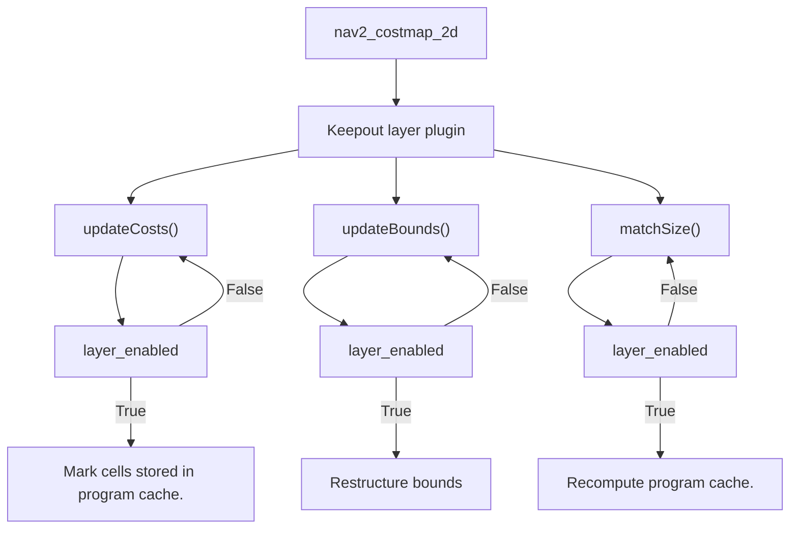
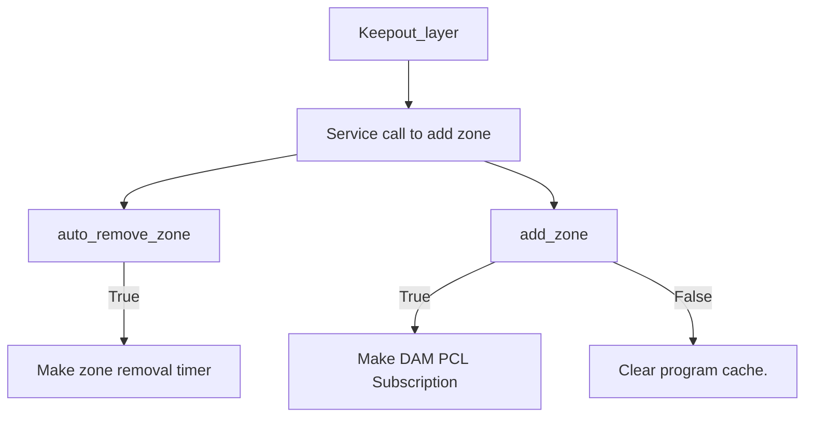
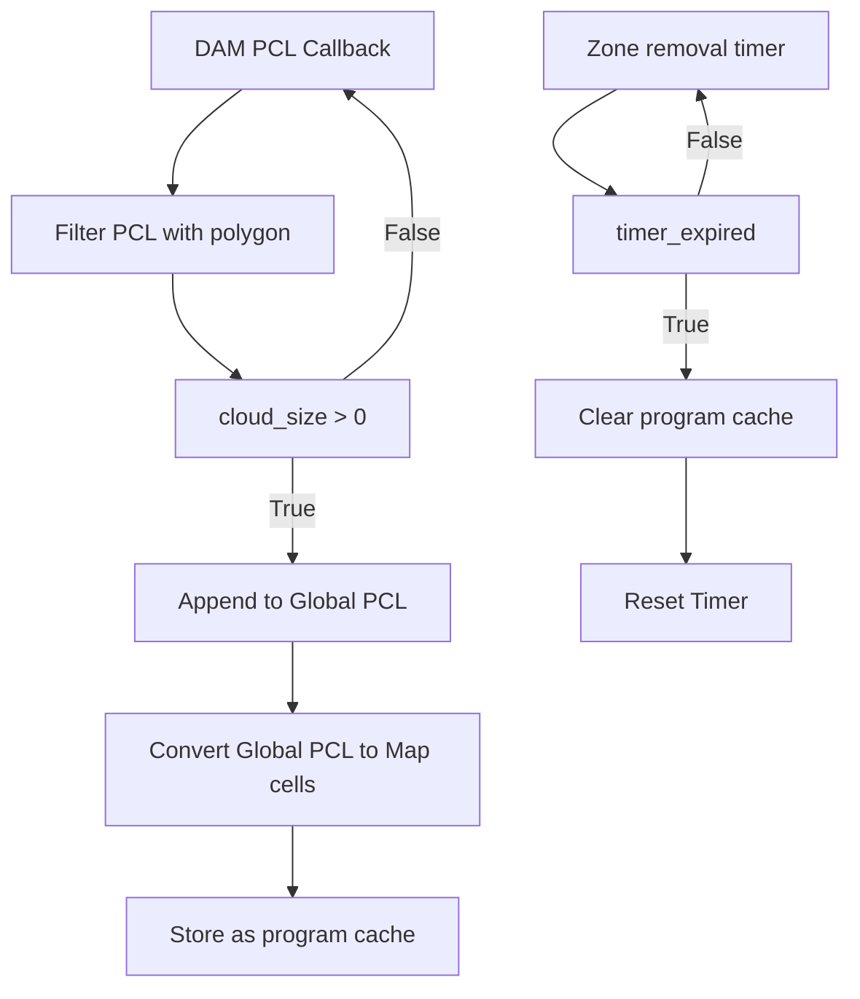

# Keepout_zones module documentation.

The keepout layer was introduced into the stack to provide re-planning in case of DAM obstacles that are in the path of the global plan. This is done by adding the DAM obstacles into the global costmap to force replanning on a deterministic planner.

## Inputs to the layer.

The inputs are simply the ```robot TF``` along with DAM pointcloud from the ```/dam_point_cloud``` topic.

## How to use:

The keepout layer runs alongside the global costmap layers in nav2. It is executed directly from the planner server in the form of a ```nav2_costmap2d plugin``` as a lifecycle node.

It can be added to use as follows:
```
plugins: ["static_layer", "keepout_layer", "inflation_layer"]
```
It is imporatant to add the ```keepout_layer``` below the ```inflation_layer``` as the layers in nav2_costmap_2d build on top of each other. If the ```keepout_layer``` is added in the end, it wont be inflated which would not result in replanning.

The parameters of this layer can be added in the ```global_costmap``` params in the nav2 params file like so:
```
keepout_layer:
    plugin: "isds/KeepoutLayer"
    enabled: True
    radius_of_keepout: 0.75
    translate_zone: 0.50
    occupancy_map_dimensions: 1000
    robot_frame_id: "base_link"
    global_frame_id: "map"
    edit_keepout_service_name: "/edit_keepout_zone"
    filter_pcl_x: 0.9
    filter_pcl_y: 0.5
    robot_inflation_x: 0.32
    robot_inflation_y: 0.5
    dam_pcl_topic: "/dam_point_cloud"
```

## Service to call to add or remove a keepout

```ros2 service call /edit_keepout_zone cb_isds_msgs/EditKeepoutZone "{add_zone: true}"```

If you want to remove the keepout, set the ```add_zone``` parameter to ```false```.

## Filtering of the DAM pointcloud.
Adding the entire DAM pointcloud to the global map would result in a very noisy addition as DAM is mostly accurate close to the robot. For this reason, the pointcloud is first filtered to contain points just in front of the robot.


In this image you can see a rectangle right in front of the robot footprint. This acts as a filter for the DAM and only the points within this polygon are added to the map.

```filter_pcl_x```, ```filter_pcl_y```, ```robot_inflation_x```, ```robot_inflation_y``` are used to specify the dimensions and translation of the keepout zone filter. The logic in which these parameters are used can be found in the code //here//.

## Usage of ```updateCosts()``` from nav2_costmap_2d
The filtered points are appended everytime a zone is added. These points are then converted to map coordinates and added to the map in the ```updateCosts()``` virtual function onto the map. This function is called periodically at the ```update rate``` of the master costmap. This runs in an independent thread.

```Note:``` The storage of program cache (points to be added to map) runs in an independent thread and does not affect the calling of virtual functions of the layer from nav2_costmap_2d.

## General logic flow of the layer.

### Flow 1 (Virtual functions called by nav2_costmap_2d)

In this, the ```layer_enabled``` is handled by modifying ```enabled_``` parameter which is inherited from ```layer.hpp```

### Flow 2 (Level 1 working of keepout layer)

Zone removal timer and DAM PCL callback run independently. Their individual working is shown in the below diagrams.

#### Flow 2a (DAM PCL Callback and Zone removal timer)
